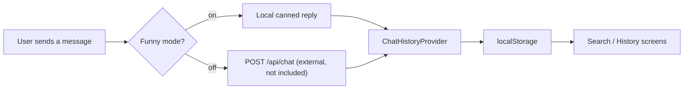

# AI Assistant Chat 💬💻✅


A React/TypeScript chat application built as a purpose-made target for practicing Playwright end-to-end testing, paired with a self-contained, in-repo Playwright course that teaches E2E testing against it.

## Overview

Two things, developed together:

1. **A small chat web app** (`src/`) — client-side routing, local persistence, and a testable UI (`data-testid`s, predictable loading/disabled states).
2. **A Playwright course** (`lessons/`) — lessons that use the app above as the system under test, each pairing an explanation with a working demo and a homework exercise.

Aimed at engineers who know JS/TypeScript and want to learn or teach Playwright against a realistic small app. The codebase is exercised from two angles: a regression-style E2E suite (`e2e/`, Page Object Model) and the teaching suite (`lessons/`).

## Key Features

- **Four-screen chat app**: Chat, Search (full-text over local history), Message history (by day), Help (collapsible troubleshooting).
- **Deterministic offline mode ("Funny mode")**: canned, letter-keyed replies, no network — the app and every test run without a backend.
- **Optional real-backend path**: typed `fetch` client (`src/api/chatApi.ts`) for `GET /api/messages`, `POST /api/chat`, `POST /api/reset`, used when Funny mode is off.
- **Client-side history**: persisted to `localStorage`, merging server and local exchanges with de-duplication.
- **Page Object Model E2E suite** (`e2e/`): one page-object class per screen via a `PageManager`.
- **Four-lesson Playwright course**: getting started, locators & actions, assertions & auto-waiting, forms & input.
- **Strict TypeScript** (`strict`, `noUnusedLocals`, `noUncheckedSideEffectImports`, …) and **GitHub Actions CI** (lint + build on push/PR to `main`).

## How It Works



The `lessons/` flow: read the lesson README → run `demo.spec.ts` → implement `homework.spec.ts` (remove its `test.fixme()`) → run it → `npx playwright show-report` → next lesson. `lessons/playwright.config.ts` auto-starts the dev server, so each lesson runs standalone.


## Testing Strategy

Two independent Playwright suites:

- **`e2e/` (regression, POM)** — root `playwright.config.ts`, Chromium, headed. `PageManager` exposes one page object per screen. Covers: chat controls render + send flow (`chat.spec.ts`), search retrieval (`search.spec.ts`), nav tabs visible (`navigation.spec.ts`), Help accordion toggling (`help.spec.ts`). Uses web-first `expect(locator)` assertions and readiness-based waits over arbitrary sleeps.
- **`lessons/` (teaching)** — own config with `baseURL` + auto-started `webServer`. Each of the four lessons has a working `demo.spec.ts` and a `test.fixme()`-gated `homework.spec.ts`.

```bash
# e2e/ suite (dev server must already be running)
npm run dev && npx playwright test

# lessons/ course (starts the dev server for you)
npx playwright test --config=lessons/playwright.config.ts
```

## Getting Started

```bash

npm install
npx playwright install chromium

npm run dev       
npm run lint
npm run build
npm run preview
```

Tests: see [Testing Strategy](#testing-strategy) above.

## Project Structure

```
ai-assistant-chat/
├── .github/workflows/ci.yml   # lint + build on push/PR to main
├── src/
│   ├── api/chatApi.ts         # client for the optional external backend
│   ├── components/            # AppLayout, ChatWindow, ChatInput, ChatMessage, ...
│   ├── lib/                   # funnyReply.ts, chatHistoryStorage.ts
│   ├── pages/                 # ChatPage, SearchChatsPage, HistoryPage, HelpPage
│   └── types/                 # Message, ChatExchange
├── e2e/
│   ├── pages/                  # Page Object Model: PageManager + per-screen classes
│   └── tests/                  # chat, search, navigation, help specs
├── lessons/
│   ├── playwright.config.ts    # standalone config; auto-starts the dev server
│   └── 01-getting-started … 04-forms-and-input/
└── playwright.config.ts        # config for e2e/
```

## License

No license file is currently included. All rights reserved by default until one is added.
