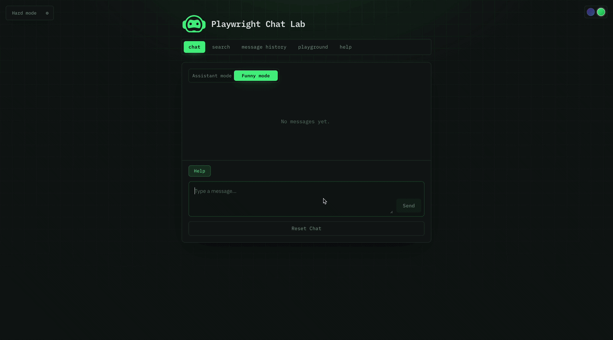

# Playwright Chat Lab

**The Playwright practice app that fights back.**

Real-world UI chaos on demand — reproducible by seed, scored by Flake Score.


> Chat Lab is a real app that turns chaotic when you ask it to:
>
> - **Real-world  behaviour, combinable** - cookie walls, flaky network, iframes - 15 flags, on one at a time or all at once.
> - **Reproducible by seed** — ten different combinations of challenges from real world applications.
> - **Flake Score** — runs your hard mode tests across all 10 seeds and tells how sustainable your tests are.



## Hard Mode

You know the feeling. The suite is green on your machine and on CI, and
then one random Tuesday it isn't. A cookie banner showed up in front of the button.
The API took four seconds instead of one. Someone removed a `data-testid`.
Nothing in your tests was wrong — the app just stopped being polite.

Flip "Hard mode" in the top-left corner and the same chat starts throwing real-world trouble at you:

- popups that block the page and a promo that keeps coming back;
- replies that take their time, messages that fail until you retry, and a
rate limit that makes you wait;
- a DOM that won't sit still — no test ids, lists that re-mount under your
locators, search results in a different order, forms tucked inside iframes
and shadow roots;
- the browser's own quirks — files, a second tab, the clipboard, timestamps  
that depend on the clock.

### And then you find out how solid they are

Passing once proves little. Flake Score runs your Hard Mode tests on all ten
trouble combinations, twice each, and tells you how many came out clean. For the rest it tells
you why: a failure you can replay by seed, a timing race the seed can't
explain, or a test that isn't ready for these flags yet.

```bash
npm run flake-score
```

Learn more:
**[src/HARD_MODE.md](src/HARD_MODE.md)**.

## Learn Playwright on it

An 11-lesson course (`[lessons/](lessons/README.md)`) uses this app as the
system under test, from the anatomy of a test through locators, fixtures, the
Page Object Model, network mocking and debugging to CI and parallelism. Each
lesson pairs an explanation with a working demo and a homework exercise;
homework is submitted as a pull request and checked by CI.

The course runs the app in its normal mode. Hard Mode is the next step once
your tests pass.

## The app

A small React/TypeScript chat with five screens — Chat, Search, Message
history, Playground and Help. It runs fully offline: "Funny mode" answers with
canned, deterministic replies, so the app and every test work without a
backend. History is kept in `localStorage`.

## Getting started

```bash
npm install
npx playwright install chromium

npm run dev     # the app on http://localhost:5173
npm run lint
npm run build
npm test        # unit tests
```


## Testing

```bash
npm run test:e2e        # e2e/ — the app's own suite and the hard mode suite
npm run test:lessons    # lessons/ — the course

# one file or folder
npm run test:e2e -- e2e/tests/chat.spec.ts
npm run test:lessons -- lessons/01-getting-started

npm run flake-score     # hard mode tests on all 10 seeds

npx playwright show-report
```

`ci.yml` runs lint, unit tests and the build on every push and PR to `main`.
For homework, comment `e2e <path/to/spec.ts>` on your PR to run just that file

## Contributing

All kinds of contributions are welcome. For homework, see
[Submitting homework](lessons/README.md#submitting-homework).

## License

Playwright Chat Lab is open-source software licensed under the [MIT License](LICENSE).